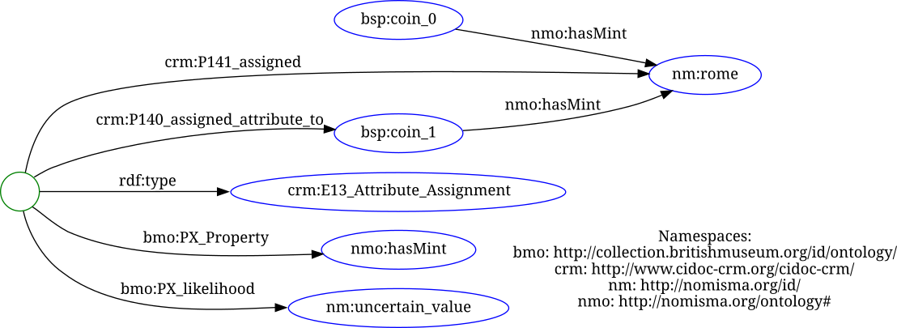
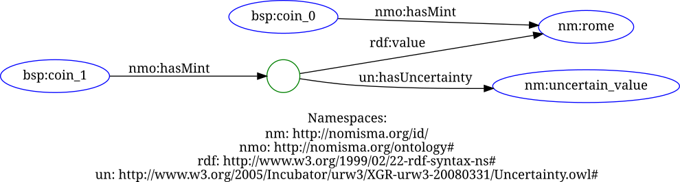
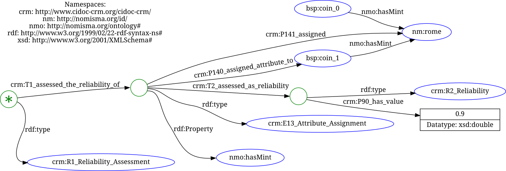
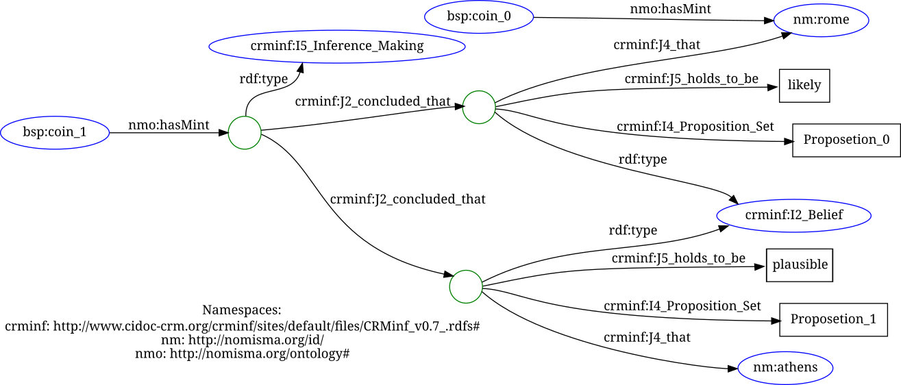
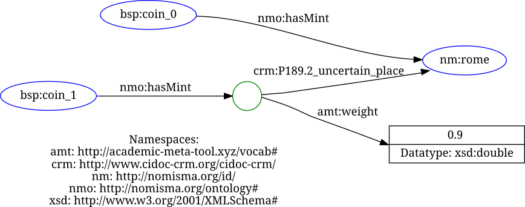
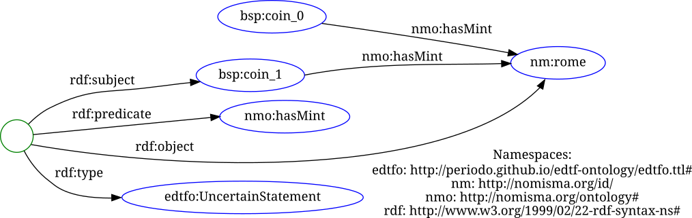
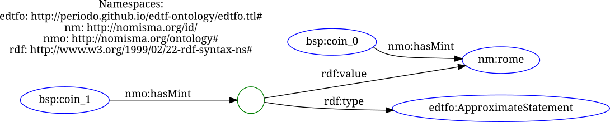
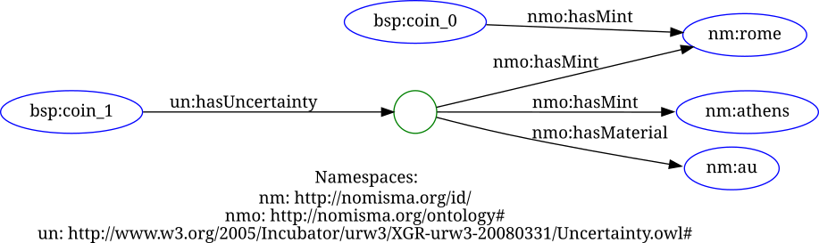
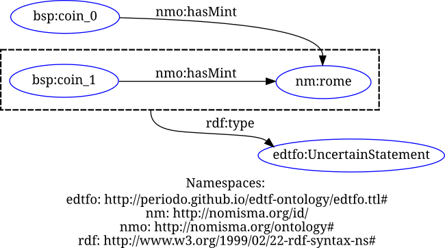
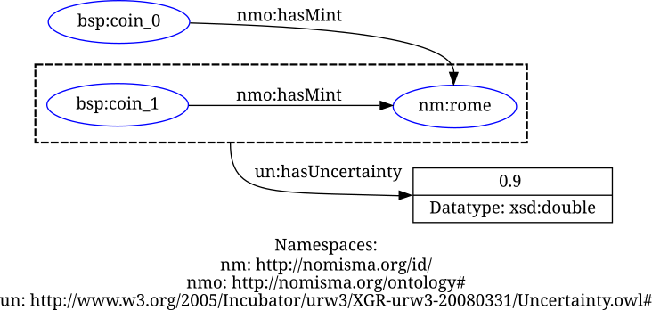

# Uncertainty Models

Below are listed all 9 modelings that the RDFier contains. A more detailed description of the modelings can be seen in the master thesis.

## Model 1:

## Model 2:

## Model 3:

## Model 4:

## Model 5:

## Model 6:

## Model 7:

## Model 8:

## Model 9a:

## Model 9b:
