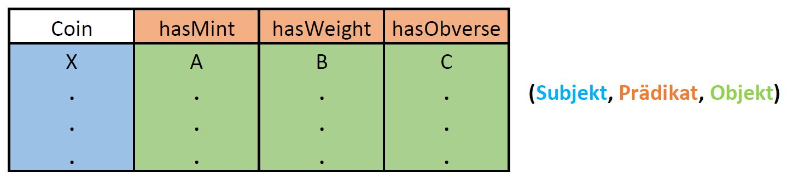

INPUT FORMAT
============
The main task of the RDFier is to build an RDF graph from a data set in the form of a csv file. Since more complex concepts in RDF graphs cannot be read easily from a csv table, here we describe how to encode them in the input.

Basic Structure
---------------
The basic structure of the input is as follows:

Thus, usually the first column denotes subjects and the subsequent columns denote objects with the respective predicate in the column header. The edges (subject, predicate1, object1), (subject, predicate2, object2) and (subject, predicate3, object3) are created from the diagram.

Some namespaces do not need to be inserted themselves, but are already available. These include:
|prefix  |namespace                                                               |
|:---    |:---                                                                    |
|amt     |http://academic-meta-tool.xyz/vocab#                                    |
|bmo     |http://collection.britishmuseum.org/id/ontology/                        |
|crm     |http://www.cidoc-crm.org/cidoc-crm/                                     |
|crminf  |http://www.cidoc-crm.org/crminf/sites/default/files/CRMinf_v0.7_.rdfs#  |
|dcterms |http://purl.org/dc/terms/                                               |
|dcmitype|http://purl.org/dc/dcmitype/                                            |
|edtfo   |http://periodo.github.io/edtf-ontology/edtfo.ttl#                       |
|foaf    |http://xmlns.com/foaf/0.1/                                              |
|geo     |http://www.w3.org/2003/01/geo/wgs84_pos#                                |
|nm      |http://nomisma.org/id/                                                  |
|nmo     |http://nomisma.org/ontology#                                            |
|org     |http://www.w3.org/ns/org#                                               |
|rdf     |http://www.w3.org/1999/02/22-rdf-syntax-ns#                             |
|rdfs    |http://www.w3.org/2000/01/rdf-schema#                                   |
|skos    |http://www.w3.org/2004/02/skos/core#                                    |
|un      |http://www.w3.org/2005/Incubator/urw3/XGR-urw3-20080331/Uncertainty.owl#|
|xsd     |http://www.w3.org/2001/XMLSchema#                                       |

Additional namespaces can be added using a csv table with the same structure, or overriding those defined above.

URI's, literals and blank nodes
-------------------------------
RDF graphs has resources in the form of URI's, literals and empty nodes. In order for a cell entry to be interpreted correctly, the type of the resource must be specified in addition to the value. The following entries are possible, where the values in curly brackets `{}` are placeholders.
 * `<{URI}>^^uri` to specify a full URI, such as: "<http://nomisma.org/id/rome>^^uri".
 * `{prefix}:{label}^^uri` to specify a shorten URI, such as: "nm:rome^^uri".
 * `{value}` bzw. `{value}^^xsd:string` to specify a literal, such as: "2023".
 * `{name}^^blank` to specify a blank node. The value *name* is only a placeholder and will be ignored by the module.

Thus, the "^^" marker is used to indicate the type of the resource. Predicates must be of type URI, so the marker in the header has no influence on the type of the predicate. Instead, the marker at this point can be used as a type assignment for all entries in the column without their own type.

**Example**:
|coins^^uri|nmo:hasMaterial^^uri|
|:---      |:---                |
|afe:5     |nm:ae               |
|afe:13    |kryptonite^^blank   |
|afe:29    |nm:ar               |

The marker `coin` is in the column header of the first column with the subjects and thus does not define a predicate, it is discarded by the program and has no effect.
The two markers `^uri` assign the type uri to all entries in their columns if they have no type of their own. Therefore entries like `nm:ae` are read as URI.
Since there is no URI for kryptonite in the *nm* namespace, this is realized by an empty node and `^blank` is used as a marker. The entry `kryptonite` has no influence and is discarded by the program.

Datatypes and Languages
-----------------------
Datatypes and languages can be assigned to literals in RDF graphs. Therefore, there needs to be a way to mark them in the input.
Here the same syntax can be used as in the Turtle format:
 * `literal^^{URI_of_datatype}` to specify a datatype.
 * `literal@{country ISO code}` to specify a language.

Since only literals can have data types and languages, no additional type marking is needed. Thus entries of the form *value^^URI* are always interpreted as literal with datatype. The URI can be specified by a full URI `<{URI}>` or an abbreviated URI `{prefix}:{label}` as described above.
A language can be specified by a two-character ISO identifier. A list of all country codes can be found [here](https://en.wikipedia.org/wiki/ISO_3166-1#Current_codes).
Similar to resource types, these markers can be moved to the column header to assign a value to all entries without resource type, data type, or languages.

**Example**:
|coins^^uri|nmo:hasMaterial^^uri|nmo:hasWeight^^xsd:decimal|
|:---      |:---                |:---                      |
|afe:5     |nm:ae               |5.24                      |
|afe:13    |kryptonite^^blank   |too heavy to weigh@en     |
|afe:29    |nm:ar               |1.16                      |

Multiple Entries
----------------
Often RDF statements have the same subject-predicate pair. For the csv input, this means that both statements can refer to the same cell.
For this reason, multiple entries can be created in the cells with objects separated by a semicolon `;`. Thus, for the above example, the text in a second language can easily be specified with `too heavy to weigh@en; zu schwer zum wiegen@de`.

Nested Statements
-----------------
In order to be able to represent also statements like "A is friends with B and B has the name Luca", the basic structure shown above can be changed.
With the marker `**{id}` at the end of the column name an ID can be assigned to a column and thus marked as a subject column.
The ID may be any string.
A subject column with ID can then be referenced with the marker `{id}__` (double underscore) at the beginning of a column name, so that the column contains objects and the predicate to the referenced subject column. For our example, this looks like the following:

|coins^^uri|nmo:hasMaterial^^uri**1|nmo:hasWeight^^xsd:decimal|1__rdf:value               |
|:---      |:---                   |:---                      |:---                       |
|afe:5     |nm:ae                  |5.24                      |                           |
|afe:13    |kryptonite^^blank      |too heavy to weigh@en     |kryptonite@en; Kryptonit@de|
|afe:29    |nm:ar                  |1.16                      |                           |

As a result of this change, the second column is now additionally interpreted as a subject column and the fourth column contains the objects and predicate belonging to it. This creates two new edges starting from the empty node with the predicate `rdf:value` and the two objects `kryptonite` and `kryptonite`.
By assigning ID 1, the original RDF statements remain.

Also, a column that references another subject column can be assigned an ID, and so on.